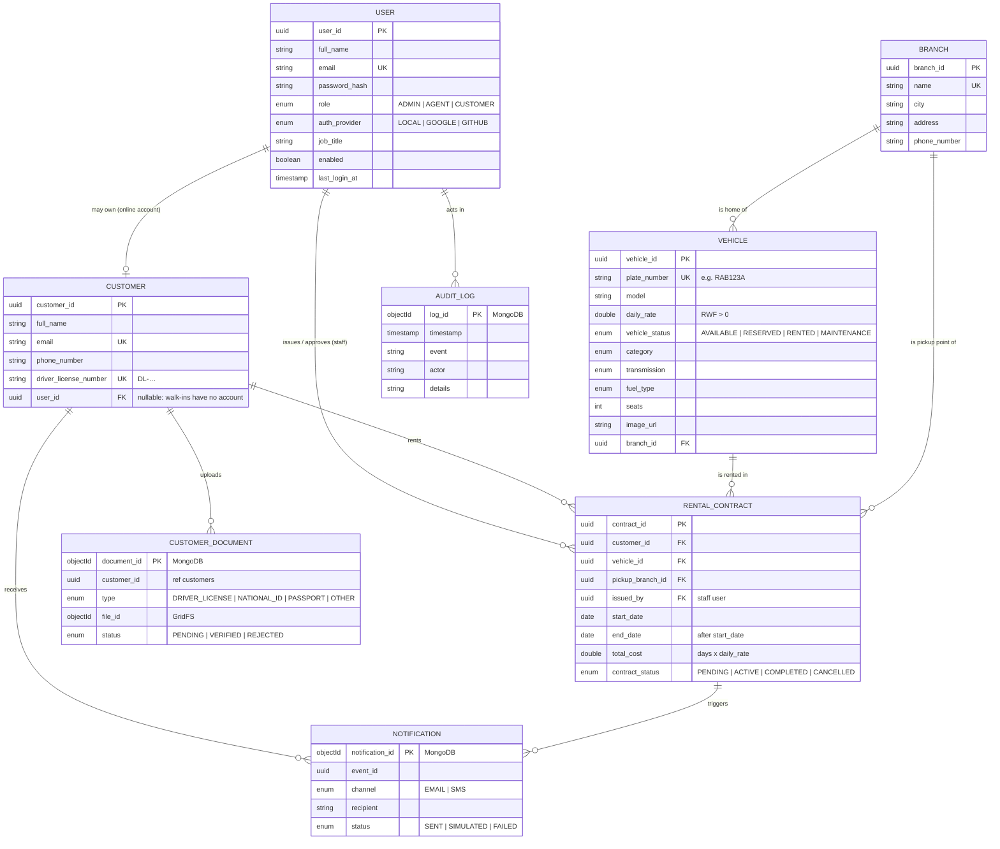
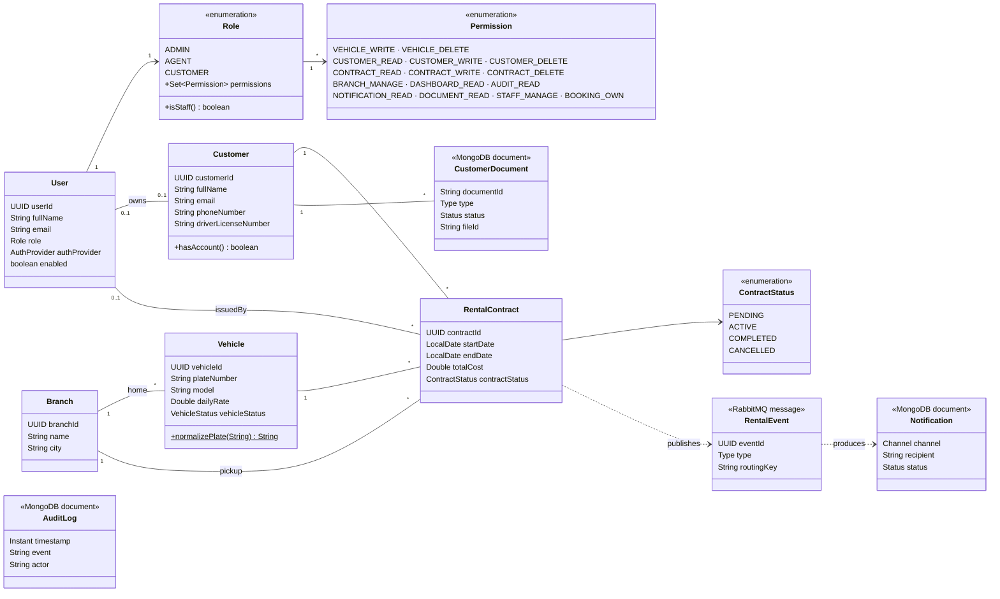
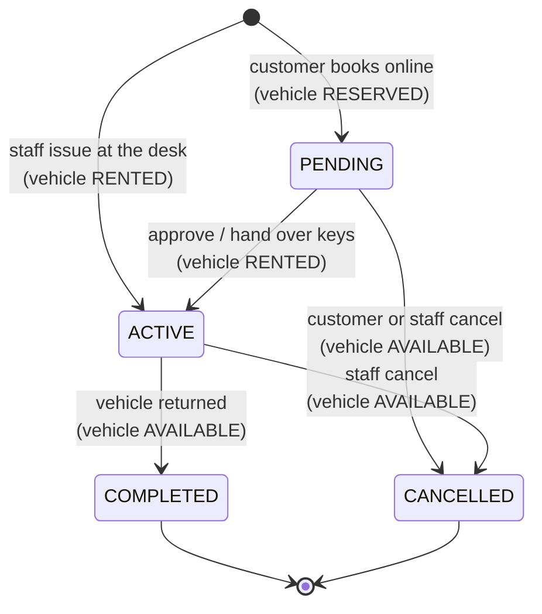

# 2. Domain & data modeling

## 2.1 Entity–relationship diagram (conceptual)



**Relationships**
- A **User** is a login. Staff users (Admin/Agent) issue contracts; a customer user owns at most one **Customer** profile (1–0..1). Walk-in customers registered by staff have no user.
- A **Customer** has many **Rental Contracts**; a **Vehicle** appears in many contracts over time, but at most **one open** (Pending/Active) contract at a time.
- A **Branch** is home to many vehicles and the pickup point of many contracts.
- **Customer documents**, **notifications** and **audit logs** live in MongoDB and reference PostgreSQL rows by UUID.

## 2.2 UML class diagram (domain model)



## 2.3 Domain concepts (implementation-independent)

**Actors**
- *Customer* – a person who rents vehicles; may book online or be served at a desk.
- *Rental agent* – front-desk staff who serve customers and move rentals through their lifecycle.
- *Operations manager* – runs the fleet and branches, supervises staff, reviews the audit trail.
- *Messaging system* – an automated actor that informs customers and staff of events.

**Processes**
1. *Customer onboarding* – capture identity and driver license, reject duplicates, link an online account to an existing walk-in record.
2. *Fleet management* – register vehicles with a valid plate and rate, assign a home branch, take vehicles in and out of maintenance.
3. *Reservation* – a customer requests a vehicle for dates; the vehicle is held until staff confirm.
4. *Rental lifecycle* – approve (hand over keys) → return, or cancel; the vehicle's availability always follows.
5. *Document verification* – customers submit license/ID scans, staff verify or reject them.
6. *Notification* – each lifecycle event informs the customer by email/SMS and alerts staff of new requests.
7. *Accountability* – every action is recorded with who and when.

**Data objects**
- *Vehicle* (identity: plate) and its *status*: Available, Reserved, Rented, Maintenance.
- *Customer* (identity: email and driver license).
- *Rental contract* – the agreement binding a customer, a vehicle, a pickup branch, dates, price and status.
- *Branch* – a physical office/pickup point.
- *Account* – credentials, role and permissions.
- *Identity document*, *notification*, *audit entry* – supporting records that grow continuously.

**Contract state machine**



## 2.4 Technology-oriented schema

VRMS uses **polyglot persistence**:

| Store | Holds | Why |
|---|---|---|
| **PostgreSQL** | users, customers, branches, vehicles, rental contracts | Strongly related data that must stay consistent: foreign keys, CHECK constraints, transactions and row locks prevent double bookings |
| **MongoDB** | audit logs, notifications, customer document metadata + files (GridFS) | Append-only, high-volume operational data with a flexible shape, and binary files; never joined in transactions |
| **RabbitMQ** | business events in flight | Decouples slow I/O (SMTP, SMS API) from requests; retries and dead-lettering |

### PostgreSQL (managed by Flyway: [`V1__initial_schema.sql`](../src/main/resources/db/migration/V1__initial_schema.sql))

**`users`**

| Column | Type | Constraints |
|---|---|---|
| user_id | uuid | **PK** |
| full_name | varchar(255) | NOT NULL |
| email | varchar(255) | NOT NULL, **unique (case-insensitive)** `uk_users_email_ci` |
| password_hash | varchar(255) | NOT NULL (BCrypt) |
| role | varchar(20) | NOT NULL, CHECK in (ADMIN, AGENT, CUSTOMER), index `idx_users_role` |
| auth_provider | varchar(20) | NOT NULL DEFAULT 'LOCAL', CHECK in (LOCAL, GOOGLE, GITHUB) |
| job_title | varchar(255) | |
| enabled | boolean | NOT NULL DEFAULT true |
| last_login_at, created_at | timestamptz | |

**`customers`**

| Column | Type | Constraints |
|---|---|---|
| customer_id | uuid | **PK** |
| full_name | varchar(100) | NOT NULL |
| email | varchar(255) | NOT NULL, unique case-insensitive `uk_customers_email_ci` (BR-01) |
| phone_number | varchar(255) | |
| driver_license_number | varchar(255) | NOT NULL, unique `uk_customers_license` (BR-01), CHECK `~ '^DL-[A-Z0-9-]+$'` (BR-02) |
| user_id | uuid | **FK → users** ON DELETE SET NULL, unique `uk_customers_user` (one profile per account) |
| created_at | timestamptz | |

**`branches`**

| Column | Type | Constraints |
|---|---|---|
| branch_id | uuid | **PK** |
| name | varchar(80) | NOT NULL, unique case-insensitive |
| city | varchar(60) | NOT NULL |
| address | varchar(150) | |
| phone_number | varchar(20) | |

**`vehicles`**

| Column | Type | Constraints |
|---|---|---|
| vehicle_id | uuid | **PK** |
| plate_number | varchar(255) | NOT NULL, unique `uk_vehicles_plate`, CHECK `~ '^RA[A-Z][0-9]{3}[A-Z]$'` (BR-04) |
| model | varchar(80) | NOT NULL |
| daily_rate | double precision | NOT NULL, CHECK `> 0` (BR-03) |
| vehicle_status | varchar(20) | CHECK in (AVAILABLE, RENTED, MAINTENANCE, RESERVED), index `idx_vehicles_status` |
| category, transmission, fuel_type | varchar(20) | CHECK against each enum |
| seats | integer | CHECK 1–60 |
| image_url | varchar(1000) | |
| branch_id | uuid | **FK → branches** ON DELETE SET NULL, index `idx_vehicles_branch` |
| created_at | timestamptz | |

**`rental_contracts`**

| Column | Type | Constraints |
|---|---|---|
| contract_id | uuid | **PK** |
| customer_id | uuid | NOT NULL, **FK → customers** ON DELETE RESTRICT, index |
| vehicle_id | uuid | NOT NULL, **FK → vehicles** ON DELETE RESTRICT, index |
| pickup_branch_id | uuid | **FK → branches** ON DELETE SET NULL |
| issued_by | uuid | **FK → users** ON DELETE SET NULL (staff who issued/approved) |
| start_date, end_date | date | NOT NULL, CHECK `end_date > start_date` |
| total_cost | double precision | CHECK `>= 0` |
| contract_status | varchar(20) | CHECK in (PENDING, ACTIVE, COMPLETED, CANCELLED), index `idx_contracts_status` |
| created_at | timestamptz | index `idx_contracts_created_at` (DESC) |

Partial indexes `idx_contracts_open_vehicle` / `idx_contracts_open_customer` (`WHERE contract_status IN ('PENDING','ACTIVE')`) make the "is there an open booking?" checks behind BR-06 and double-booking prevention cheap.

### MongoDB (database `vrms`)

| Collection | Shape | Indexes |
|---|---|---|
| `audit_logs` | `{ _id, timestamp, event, actor, details, amount?, plateNumber?, customerName? }` | `timestamp` desc; `event`; compound sparse `{plateNumber:1, timestamp:-1}` for the dashboard |
| `notifications` | `{ _id, createdAt, eventId, eventType, channel, recipient, subject, body, status, provider, error?, customerId?, contractId? }` | `createdAt` desc; `eventId` (idempotency); sparse `customerId` |
| `customer_documents` | `{ _id, customerId, type, fileName, contentType, sizeBytes, fileId, status, uploadedBy, uploadedAt, reviewedBy?, reviewedAt?, reviewNote? }` | `customerId` |
| `fs.files` / `fs.chunks` | GridFS file storage (metadata `customerId`, `type`) | GridFS defaults |

Example `notifications` document:

```json
{
  "_id": "66fe9c…",
  "createdAt": "2026-10-03T12:38:04Z",
  "eventId": "3f1c…",
  "eventType": "booking.requested",
  "channel": "SMS",
  "recipient": "+250788245610",
  "body": "VRMS: booking received for Toyota RAV4, 6 Oct–10 Oct. We'll confirm shortly.",
  "status": "SIMULATED",
  "provider": "Simulated",
  "customerId": "a1b2…",
  "contractId": "fd08…"
}
```

### RabbitMQ topology

| Exchange | Type | Routing keys → queue |
|---|---|---|
| `vrms.events` | topic | `booking.*`, `contract.*`, `customer.*`, `document.*` → `vrms.notifications.email` |
| | | `booking.requested`, `contract.*`, `document.*` → `vrms.notifications.sms` |
| | | `booking.requested` → `vrms.staff.alerts` |
| `vrms.events.dlx` | fanout | → `vrms.dead-letter` (messages that failed 3 attempts) |

Messages are JSON `RentalEvent`s: `{ eventId, type, occurredAt, contractId, customerId, customerName, customerEmail, customerPhone, vehicleModel, plateNumber, pickupBranch, startDate, endDate, totalCost, detail }`.
