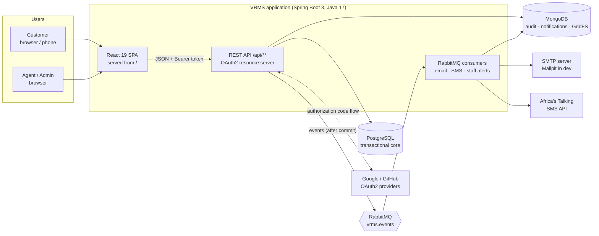
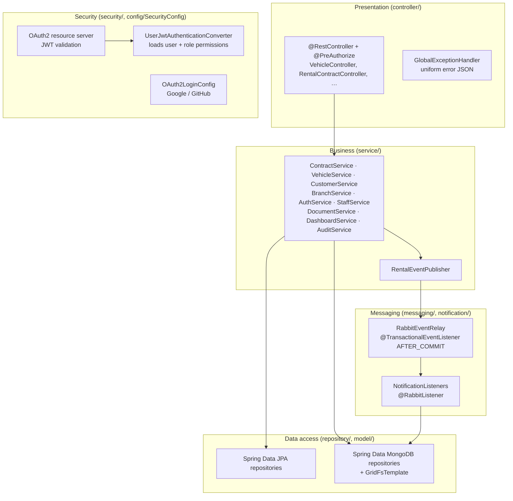
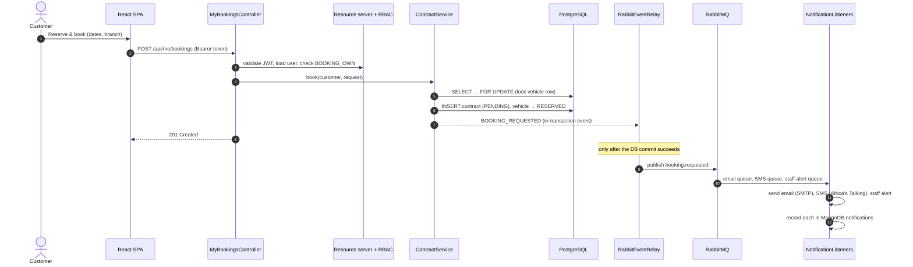
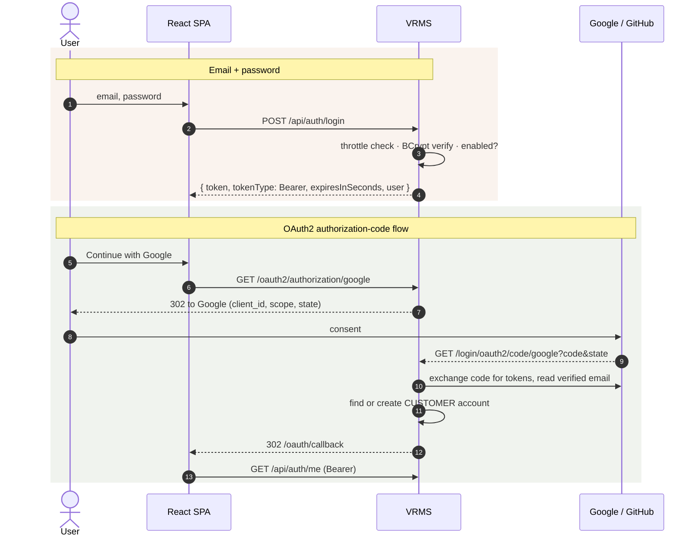
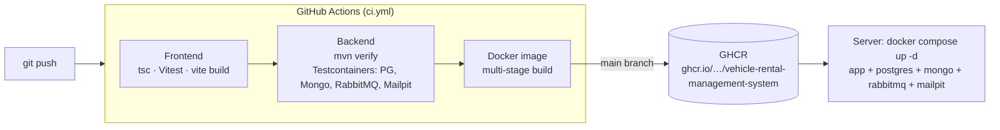

# 3. Architecture

VRMS is a **layered monolith with event-driven messaging**: one Spring Boot application, organised in
strict layers, that publishes business events to RabbitMQ for asynchronous work (email, SMS, staff
alerts). The React single-page app is built into the same deployable jar.

## 3.1 System context and containers

## 3.2 Backend layers

| Package | Responsibility |
|---|---|
| `controller` | HTTP endpoints, request validation (`@Valid`), permission checks (`@PreAuthorize`). No business logic. |
| `dto` | Request/response records (`BookingRequest`, `UserView`, …) so entities aren't bound directly where it matters. |
| `service` | Business rules and transactions (contract state machine, duplicate checks, vehicle status). |
| `repository` / `model` | JPA entities + repositories (PostgreSQL) and Mongo documents + repositories. |
| `security` | Token issuing/validation, user loading, login throttling, OAuth2 account mapping. |
| `messaging` / `notification` | Domain events, RabbitMQ relay, consumers, templates, SMS gateways. |
| `config` | Security chains, RabbitMQ topology, caches, OpenAPI, SPA serving, seed data. |

### Request flow: customer books a vehicle

## 3.3 Security

### Authentication: OAuth2

The REST API is an **OAuth2 resource server** (`spring-boot-starter-oauth2-resource-server`). Every
request carries `Authorization: Bearer <access token>`; tokens are JWTs signed with HS256 and checked
for **signature, expiry, issuer (`vrms`) and audience (`vrms-api`)**. The token's subject is re-loaded
from the database on each request, so disabling an account or changing a role takes effect immediately.

Tokens are obtained in two ways:

Other protections: BCrypt password hashing; password policy (8+ chars, letters and digits);
**lockout after 5 failed sign-ins** per email and client for 15 minutes; Content-Security-Policy,
referrer policy and `X-Content-Type-Options` headers; uploads checked by magic bytes; secrets kept out
of Git (`application-secrets.properties`, `.env`); CORS restricted to known origins.

### Authorization: RBAC

Each role is a fixed bundle of permissions (`Role.java`). URL rules give a first coarse filter
(`/api/me/**` customers only, staff areas staff only), then **every protected endpoint declares the
permission it needs** with `@PreAuthorize("hasAuthority('…')")`. The UI hides what a user can't do,
but the API enforces it regardless.

| Permission | Admin | Agent | Customer | Used by |
|---|:-:|:-:|:-:|---|
| VEHICLE_WRITE | ✓ | ✓ | | add/edit vehicles, maintenance |
| VEHICLE_DELETE | ✓ | | | delete vehicles |
| CUSTOMER_READ | ✓ | ✓ | | customer directory |
| CUSTOMER_WRITE | ✓ | ✓ | | register/edit customers, review documents |
| CUSTOMER_DELETE | ✓ | | | delete customers |
| CONTRACT_READ | ✓ | ✓ | | contracts list |
| CONTRACT_WRITE | ✓ | ✓ | | issue, approve, return, cancel |
| CONTRACT_DELETE | ✓ | | | delete contract records |
| BRANCH_MANAGE | ✓ | | | create/edit/delete branches |
| DASHBOARD_READ | ✓ | ✓ | | dashboard KPIs |
| AUDIT_READ | ✓ | | | system logs |
| NOTIFICATION_READ | ✓ | ✓ | | sent emails/SMS |
| DOCUMENT_READ | ✓ | ✓ | | view customer documents |
| STAFF_MANAGE | ✓ | | | staff accounts and roles |
| BOOKING_OWN | | | ✓ | own bookings, profile, documents, messages |

Safeguards: admins can't disable or demote themselves, and the last active admin can't be removed.
Customers only ever see their own bookings, documents and messages; another customer's document id
returns 404.

## 3.4 Messaging (RabbitMQ)

- Services raise a `RentalEvent` inside their transaction; `RabbitEventRelay` publishes it to the
  **`vrms.events` topic exchange only after commit**, so rolled-back actions never notify anyone.
- Three durable queues consume it: **email** (customer emails over SMTP), **SMS** (Africa's Talking,
  simulated without an API key) and **staff alerts** (new bookings).
- Failures are retried 3 times with back-off (1 s, 2 s), then **dead-lettered** to `vrms.dead-letter`.
- Consumers are **idempotent**: a redelivered event doesn't send the same email/SMS twice.
- Every delivery is recorded in MongoDB and shown on the staff *Notifications* page and the customer's
  *Messages* list. In development, every email can be read at http://localhost:8025 (Mailpit).

## 3.5 Performance

| Technique | Where |
|---|---|
| Caffeine caches: public fleet (evicted on vehicle/contract writes), branches, dashboard (15 s) | `CacheConfig`, `@Cacheable`/`@CacheEvict` |
| Entity graphs: contracts and vehicles load their associations in one query (no N+1) | `RentalContractRepository`, `VehicleRepository` |
| Indexes incl. partial indexes for open bookings; MongoDB indexes for logs and notifications | `V1__initial_schema.sql`, `@Indexed` |
| Gzip responses (≈70% smaller JSON) | `server.compression.*` |
| Fingerprinted assets cached 1 year (`immutable`), `index.html` revalidated | `SpaConfig` |
| Code-split staff console (lazy routes), public bundle 100 KB gzipped | `App.tsx` |
| Slow I/O (SMTP, SMS API) off the request path via RabbitMQ | §3.4 |
| JDBC batching, tuned Hikari pool, `open-in-view=false` | `application.properties` |

Measured on a laptop with the Docker stack (100 requests each, gzip): `GET /api/vehicles` p95 **18 ms**,
`/api/contracts` p95 **80 ms**, `/api/dashboard` p95 **95 ms**, `/api/logs` (MongoDB) p95 **75 ms**.

## 3.6 Deployment & DevOps

- **Dockerfile**: Node builds the SPA → Maven builds the jar with it → `eclipse-temurin:17-jre-alpine`, non-root user, health check on `/actuator/health`.
- **docker-compose.yml**: the full stack with health-checked dependencies; settings from `.env`.
- **Schema**: Flyway migrations run on start-up; Hibernate validates the schema.
- **Observability**: `/actuator/health` reports PostgreSQL, MongoDB, RabbitMQ and SMTP; RabbitMQ management UI on :15672; API docs at `/swagger-ui.html`.
